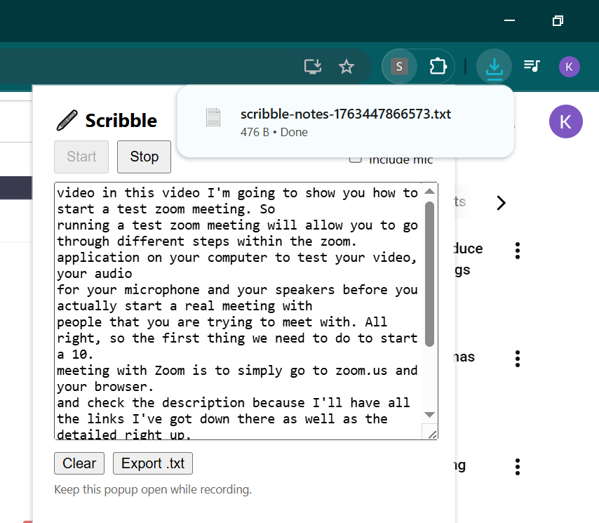
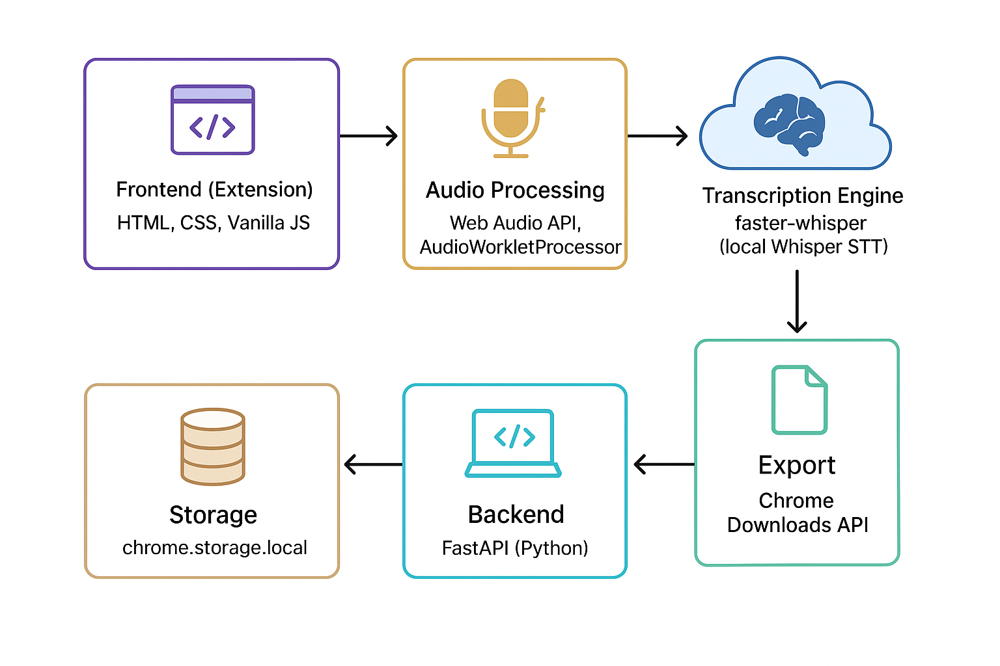
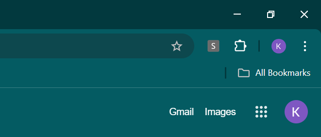
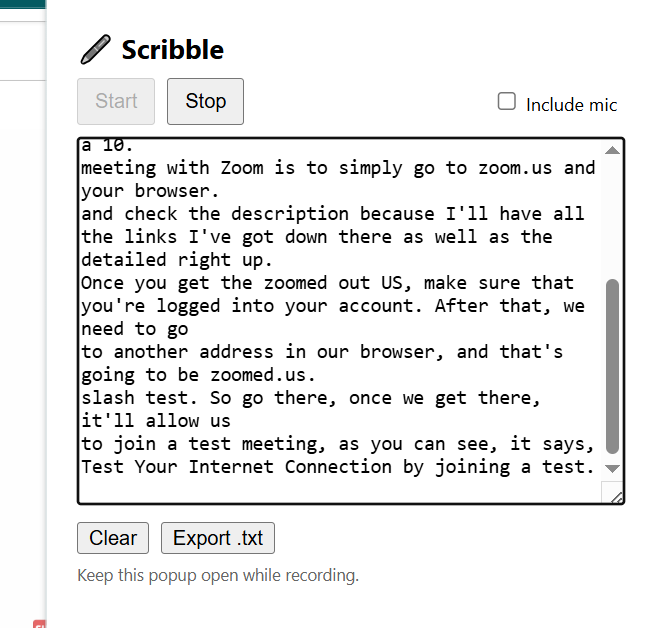
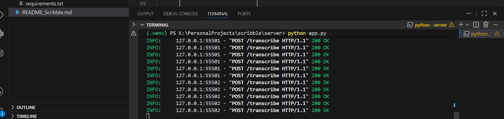
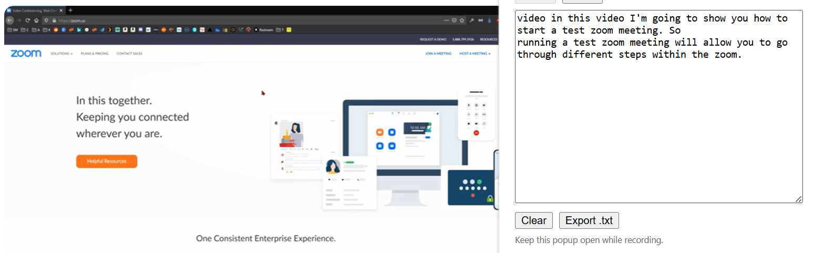

# 🖊️ Scribble : AI Meeting Notetaker (Chrome Extension + Local Whisper STT)

> “I've been working remotely for over **3 years**, and during meetings I often found myself struggling to take notes while staying engaged in the conversation.  
> Missing key points started to **decrease my work quality**, especially in fast-paced discussions.  

> That’s why I built **Scribble** : an AI-powered Chrome extension that automatically listens, transcribes, and stores your meeting notes **locally** , without sending your audio anywhere.”




---

## Overview

**Scribble** is a local-first Chrome extension that captures your meeting tab’s audio (and optionally microphone), sends short audio chunks to a **local Whisper server**, and returns live text notes in real time.

-  Works offline : no cloud APIs or uploads  
- 100% privacy : everything stays on your machine  
-  Real-time transcription while you hear the meeting normally  
-  Notes auto-save locally and can be exported as `.txt`


---

## Architecture 

This architecture illustrates how the Chrome extension captures microphone audio, processes it using the Web Audio API, and streams it to a FastAPI backend. The backend uses the faster-whisper engine to convert audio into text and returns the transcription to the extension. The extension then stores notes using chrome.storage.local and allows users to export them through the Chrome Downloads API.




---

##  Technology Stack

| Layer | Tech Used | Purpose |
|-------|------------|---------|
| **Frontend (Extension)** | HTML, CSS, Vanilla JS | Lightweight Chrome popup UI |
| **Audio Processing** | Web Audio API, `AudioWorkletProcessor` | Captures and chunks PCM audio |
| **Transcription Engine** |  `faster-whisper` (local Whisper STT) | Converts audio → text |
| **Backend** | FastAPI (Python) | Receives audio, transcribes, returns text |
| **Storage** | `chrome.storage.local` | Saves notes persistently |
| **Export** | Chrome Downloads API | Saves notes as `.txt` files |


### Frontend (Extension): HTML, CSS, Vanilla JavaScript

The frontend of the Chrome extension is built using lightweight and efficient web technologies: HTML for structure, CSS for styling, and Vanilla JavaScript for interaction logic. Since Chrome extensions require quick loading and minimal overhead, using pure JavaScript without frameworks keeps the popup UI fast and responsive. This frontend provides a simple interface where users can start or stop recording, view their transcriptions, and manage stored notes. It runs entirely inside the extension popup, ensuring a smooth user experience without the need for external web pages or heavy UI libraries.

### Audio Processing: Web Audio API & AudioWorkletProcessor

Audio recording and processing are handled completely inside the browser using the Web Audio API, one of the most powerful browser-native audio frameworks. The system uses an AudioWorkletProcessor to capture raw microphone input at very low latency. The processor receives real-time PCM (Pulse Code Modulation) audio frames, which form the raw waveform data required for accurate speech-to-text transcription. Unlike basic media recorders, the Worklet runs on an isolated audio thread, enabling precise, continuous audio streaming without glitches, buffering delays, or loss of data. This makes it ideal for feeding small chunks of audio directly to the transcription backend.

### Transcription Engine: faster-whisper (Local Whisper STT)

For speech recognition, the backend uses faster-whisper, a high-performance C++/Python implementation of OpenAI’s Whisper model. While Whisper traditionally runs slowly on CPU, faster-whisper uses optimized kernels, quantization, and efficient decoding strategies to deliver real-time or near real-time transcription on most machines. The engine takes raw PCM audio chunks from the extension and converts them into accurate text using Whisper’s multilingual STT (Speech-to-Text) capabilities. Running Whisper locally provides several benefits: improved privacy (no cloud uploads), offline transcription capability, and full control over the model configuration and performance.

### Backend: FastAPI (Python)

The backend server is implemented using FastAPI, a modern high-performance Python framework designed for building APIs quickly and efficiently. FastAPI receives audio chunks streamed from the Chrome extension, passes them to the faster-whisper transcription engine, and returns the resulting text in structured JSON format. Its asynchronous architecture ensures that the system can handle continuous audio streaming without blocking. FastAPI also provides built-in automatic API documentation and type validation, making development and debugging straightforward.


---

##  Speech-to-Text Model

Scribble uses **[Faster-Whisper](https://github.com/guillaumekln/faster-whisper)** — a high-performance implementation of OpenAI’s Whisper model.

- Default model: `base`  
- You can switch sizes via environment variable:  
  ```bash
  set WHISPER_MODEL=small
  set COMPUTE_TYPE=float16  # for GPU
  ```
- All inference happens locally (no external API calls).

---

## 🛠️ How to Run the Project

### 1. Clone the repo and enter the server folder
```bash
git clone https://github.com/yourusername/scribble.git
cd scribble/server
```

### 2. Set up virtual environment
```bash
python -m venv .venv
.\.venv\Scripts\activate   # Windows
pip install -r requirements.txt
```

### 3. Start the local Whisper server
```bash
python app.py
```
You should see:
```
Uvicorn running on http://0.0.0.0:8000
```
Test health check:
 http://localhost:8000/health → returns `{ "ok": true }`

---

### 4. Load the Chrome Extension
1. Open `chrome://extensions`
2. Enable **Developer Mode**
3. Click **Load unpacked**
4. Select the `scribble/extension` folder
5. Pin **Scribble** to your toolbar

---

##  Flow of the Project

```
[Meeting Tab Audio] ─► Chrome Tab Capture
       │
       ▼
AudioWorklet (16kHz PCM)
       │
       ▼
Scribble Extension  ─► Local FastAPI Server (http://localhost:8000/transcribe)
       │                        │
       │                        ▼
   Text Transcription  ◄── Faster-Whisper STT
       │
       ▼
  Notes Displayed + Saved Locally
```

- The extension captures tab audio and (optionally) mic audio.
- The browser converts it into 16kHz mono PCM using an AudioWorklet.
- Every few seconds, it sends a small WAV chunk to the local FastAPI endpoint.
- The Whisper model transcribes and returns text.
- The popup appends transcribed lines live in the notes field.

---

##  How to Use the Extension

1. **Start your meeting** (Google Meet, Zoom Web, Teams Web, etc.)
2. Click the **Scribble** icon on your Chrome toolbar.
3. Toggle “Include Mic” if you want your voice recorded too.
4. Click **Start** : you’ll continue hearing everything normally.
5. Watch the notes appear live in the popup.
6. Click **Stop** to end capture.
7. Click **Export .txt** to save your notes.

💡 **Tip:** Keep the popup open while recording (for now).  
A background “offscreen document” version is planned so you can close the popup.

---

## Testing

The extension appears as an icon in Browser. 



It can take notes. Also gives option to include your mic. 



In the Backend Server each token is being processed and saved.



The meeting notes are displayed side by side. 


The meeting notes can be exported as a text file. 


##  Future Improvements

- [ ] Run in background without popup open  
- [ ] Markdown or timestamped transcript export  
- [ ] Multi-language auto-detect  
- [ ] Speaker diarization (who said what)  
- [ ] Noise filtering and VAD-based chunking  

---

##  Author

**Built by:** Kiran Sardar  
🧠 AI Engineer | 🎙️ Productivity Enthusiast  
> “Scribble was born from real pain - missing context in meetings.  
> Now I can stay fully present and still keep perfect notes.
> This is an open source project , anyone can download and use it. 
